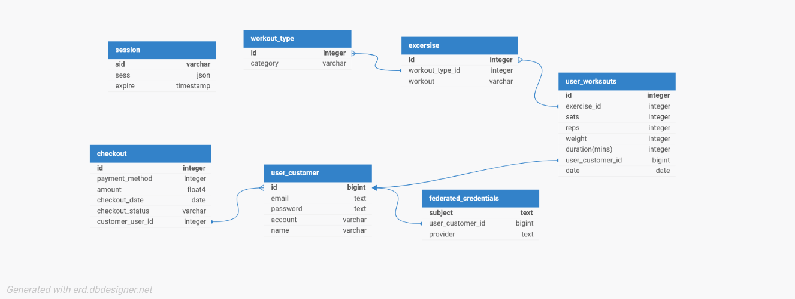

# Portfolio Project - Full-Stack Sports App
This sports Pern app is a Codecademy Portfolio Project implemented using Node.js, Express.js for the backend, Postgres SQL for the database. 

Frontend is implemented using HTNL, CSS, Javascript, React and Redux.

## Project Goal:

In this project, you’ll be coming up with your own topic for a final project. This is your chance to bring together everything that you have learned so far to showcase your skills. 

## Project Objectives:

- Create a front-end using React.js
- Create a server using Node.js, Express.js
- Use a PostgreSQL database to store your data
- Set up proper security
- Create tests to ensure integrity of your code
- Deploy the web application using Render

## Features

#### Users
- User register and login.
- User authentication completed with Passport.js
- Crud operations on User

#### Dashboard
- User statistics and workout route for selected date. 
- UI showing bar chart and pie chart for data visualisation.

#### Workouts
- Crud operations on user workouts
- User can and a delete a workout for selected date.
- Updated workouts feed the dashboard.

#### Security
- User authentication and authorization
- Hashing of password using bcypt and salt
- Parameterized queries to protect against SQL injection
- Input validation and sanitizer to protect againt XSS attacks

## Technologies
- HTML
- CSS
- React
- Redux
- PostgresSQL
- Node.js
- Express.js

## Documents

#### ERD

#### Excalidraw
![Download Excalidraw Plan] (resources/squat_goals_whiteboard.excalidraw)

#### Wireframe

#### Link to project plan
[Project Plan](https://github.com/users/Kdevop/projects/5/views/2)

Please note the above will need to be opened on excalidraw.com. Please download the file from resources and visit there site.

## Build Instructions

#### Install dependencies
In the product directory, run > npm install

## Start Command
npm run launch

## Site Demo
User Name: someone@email.com
Password: passwordforuser

#### Demo User Credentials

## Upcoming improvement
- AI chatbot
- Payment route
- User roles updates
- Improvements to responsive design for mobile

## Credits

Royalty free images from Unsplash https://unsplash.com/ and Pexcels https://www.pexels.com/.

Inspiration for the idea from GeekforGeeks https://www.youtube.com/@GeeksforGeeksVideos.
